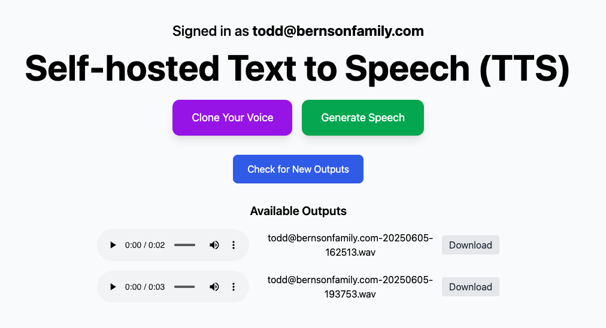

# Voice Clone – Real-Time Speech Synthesis on Kubernetes with Sensible AWS Serverless Architecture

Welcome to **Voice Clone**, your one-stop shop for real-time, self-hosted voice synthesis powered by Tortoise TTS and Flask, fully automated with Terraform, ArgoCD, and Docker. Deploy the entire stack into Kubernetes and scale your voice.

Live Demo: [Dead Link]

---

## 📚 Table of Contents

- [Voice Clone – Real-Time Speech Synthesis on Kubernetes](#️-voice-clone--real-time-speech-synthesis-on-kubernetes)
- [What This Does](#what-this-does)
- [Architecture](#architecture)
- [Tech Stack](#tech-stack)
- [How to Deploy](#how-to-deploy)
  - [1. Clone This Repo](#1-clone-this-repo)
  - [2. Deploy the Infra with Terraform](#2-deploy-the-infra-with-terraform)
  - [3. Build and Push the Docker Image](#3-build-and-push-the-docker-image)
  - [4. Bootstrap ArgoCD](#4-bootstrap-argocd)
  - [5. Let ArgoCD Deploy Everything](#5-let-argocd-deploy-everything)
- [Example Usage](#-example-usage)
- [Screenshot](#screenshot)
- [Credits](#credits)
- [Built by Todd Bernson](#built-by-todd-bernson)

---

## What This Does

- Converts text into hyper-realistic speech using [Tortoise TTS](https://github.com/neonbjb/tortoise-tts)
- Packs it all into a Docker container running Flask
- Deploys to a K8s cluster using **ArgoCD**, which then **self-manages**
- Uses Terraform to provision **S3, IAM, ECR, EKS**, and all needed AWS resources
- Automates everything from infrastructure to app deployment

---

## Architecture

```text
Terraform → AWS Infra (EKS, S3, ECR, IAM)
↓
Docker (Flask + Tortoise TTS)
↓
ArgoCD (bootstrap + self-manage)
↓
Kubernetes (Flask App + Ingress)
```
---

## Tech Stack

- [x] Terraform (infra as code)
- [x] Tortoise TTS (voice cloning)
- [x] Flask (API layer)
- [x] Docker (containerization)
- [x] ArgoCD (GitOps magic)
- [x] Kubernetes (orchestration)

---

## How to Deploy

### 1. Clone This Repo

```bash
git clone https://github.com/semperfitodd/voice_clone.git
cd voice_clone
```

---

### 2. Deploy the Infra with Terraform

Make sure you have AWS credentials set via `aws configure` or env vars.

```bash
cd terraform
terraform init
terraform apply -auto-approve
```

This sets up:
- EKS Cluster
- ECR Repo
- S3 Bucket (optional)
- IAM Roles

---

### 3. Build and Push the Docker Image

This is done automatically by Terraform, but you can also do it manually:

```bash
cd docker
docker build -t voice-clone .
aws ecr get-login-password --region us-east-1 | docker login --username AWS --password-stdin <your_ecr_url>
docker tag voice-clone <your_ecr_url>/voice-clone
docker push <your_ecr_url>/voice-clone
```

---

### 4. Bootstrap ArgoCD

ArgoCD is deployed **via Terraform**, and will self-manage after initial install.

Get the ArgoCD login credentials and open the UI:

```bash
kubectl get pods -n argocd
kubectl port-forward svc/argocd-server -n argocd 8080:443
```

Then go to: [https://localhost:8080](https://localhost:8080)

Username: `admin`  
Password: Get it with:

```bash
kubectl -n argocd get secret argocd-initial-admin-secret -o jsonpath="{.data.password}" | base64 -d
```

---

### 5. Let ArgoCD Deploy Everything

Once ArgoCD is live, it will detect changes to the repo and handle all Kubernetes deployments:
- Flask app
- Service
- Ingress
- Tortoise TTS pod
- Any future enhancements 🔁

---

## Example Usage

POST to `/synthesize` with JSON:

```json
{
  "text": "Welcome to Voice Clone",
  "voice": "pat"
}
```

This will save the audio file in the S3 bucket.

---

## Screenshot




---

## Credits

- [Tortoise TTS](https://github.com/neonbjb/tortoise-tts)
- [Flask](https://flask.palletsprojects.com/)
- [ArgoCD](https://argo-cd.readthedocs.io/)
- [Terraform](https://www.terraform.io/)

---

## Built by Todd Bernson

AWS Ambassador | DevOps Nerd | Real-time ML Enthusiast  
[todd.bernson.info](https://todd.bernson.info) | [LinkedIn](https://www.linkedin.com/in/todd-bernson/)

